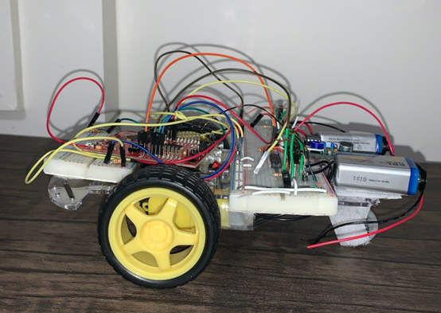
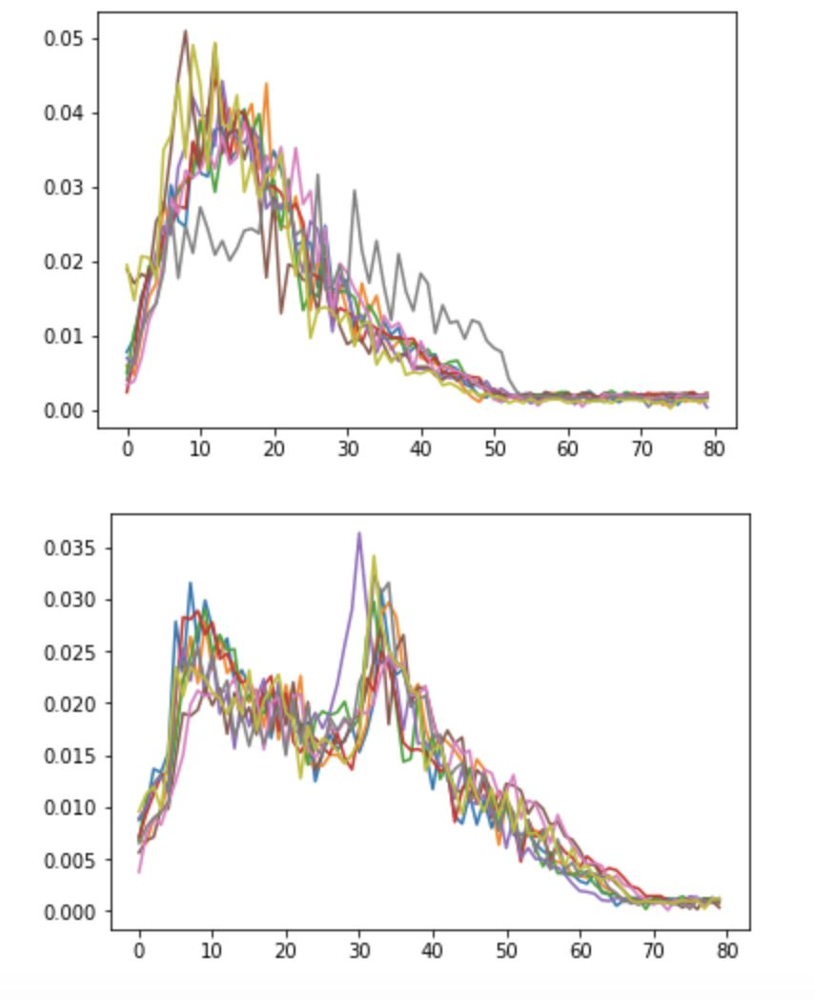
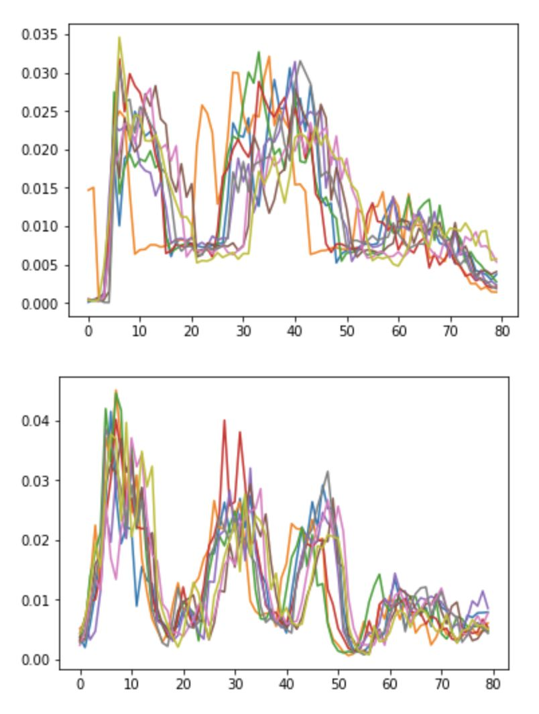
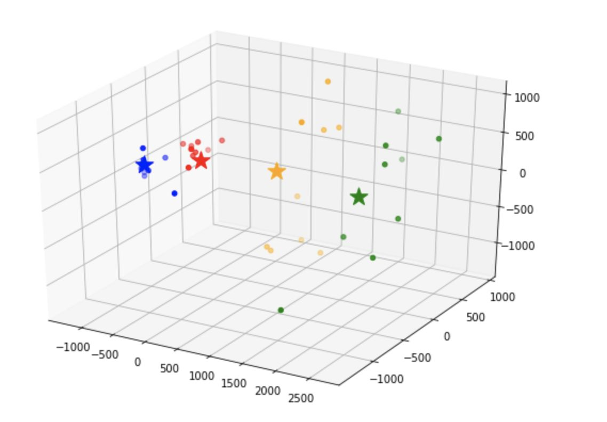
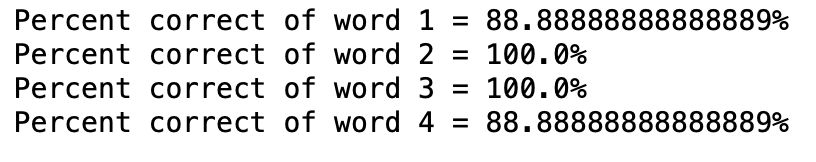
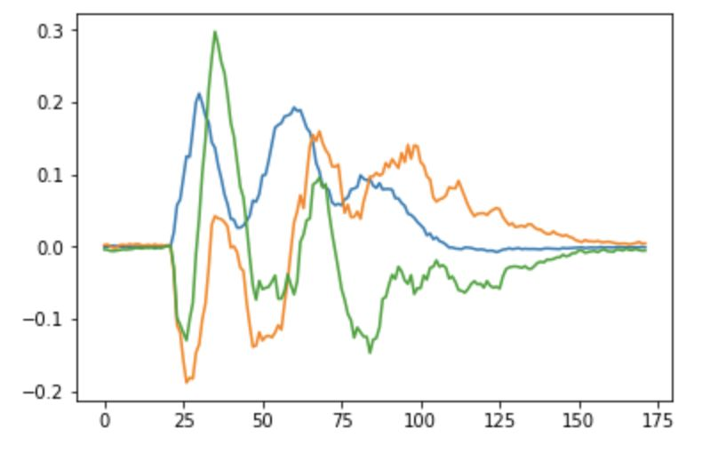

# SIXT33N
A robot car that can hear your commands to move in desired direction.

# PREVIEW

### Process
After reading the data into our directory, we had to align audio recordings. This is because we may start to pronounce the word a bit after the red light blinks (indicating that it starts recording), so we cut off the part where the data is noises. We achieved this by setting length and threshold variables relative to the maximum value of the data.

We then generated and preprocessed PCA matrix by stacking the four words together. We also demeaned the matrix because we want to center the data around the mean to eliminate the intensity fluctuations (our speaking might vary).

To save memory and ease computation, we picked the first four principal (with the biggest sigma values, meaning the biggest variance) components to represent the whole data set.

We wrote code of find_centroids function to find clustering data points.

We then did the same preprocessing to the test data.

At last, we tested the classifier and find the accuracy.

### Description
- Implemented a PCA voice classifier and deployed it using C/C++ coding in Unix/Linux environments.
- Brought to analyze information to choose the best commands.
- Created technical solutions and applied engineering principles to solve problems and complete software projects with members from diverse culture.

### Skills to learn
- C/C++
- Python
- Software Development
- Unix/Linux

